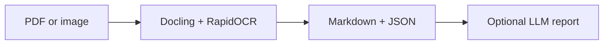

# OCR + LLM Document Pipeline

A pipeline for processing PDFs and images:

1. OCR and document structuring via **Docling** + **RapidOCR**.
2. Image preprocessing via OpenCV.
3. Export results to Markdown and JSON.
4. Generate a concise analytical report via **Ollama Cloud** (`gemma4:31b-cloud`) through a LlamaIndex/OpenAI-like API.

The original notebook is saved at `notebooks/week2.ipynb`.

## Architecture



## Structure

The `examples/synthetic-report-v1/` directory contains the public smoke-test input generator and reference.

```text
.
├── examples/synthetic-report-v1/  # reproducible input generator and review guide
├── notebooks/week2.ipynb         # original exploratory notebook
├── src/ocr_llm_pipeline.py       # local CLI and pipeline
├── tests/                        # behavior checks
├── .github/workflows/ci.yml      # lint and tests
├── requirements.txt
├── requirements-dev.txt
└── README.md
```

## Installation

```bash
python -m venv .venv
source .venv/bin/activate  # Windows: .venv\Scripts\activate
pip install -r requirements.txt
```

## Environment variables

To generate reports via Ollama Cloud, set an API key:

```bash
export OLLAMA_API_KEY="your_api_key"
```

In Google Colab, you can use the `ocr_olama` secret, as in the original notebook.

## Running

Example: process documents from the `ocr_samples` folder:

```bash
python src/ocr_llm_pipeline.py \
  --input-dir ./ocr_samples \
  --markdown-dir ./md_results \
  --reports-dir ./final_results \
  --assets \
  --run-llm
```

Supported formats: `.pdf`, `.jpg`, `.jpeg`, `.png`.

## Reproducible synthetic input

Start with the [versioned synthetic report fixture](examples/synthetic-report-v1/README.md). It includes a dependency-free PDF generator, an authored target Markdown table, and a concrete error-review checklist.

```bash
python examples/synthetic-report-v1/generate.py
python src/ocr_llm_pipeline.py \
  --input-dir examples/synthetic-report-v1/input \
  --markdown-dir md_results/synthetic-report-v1
```

Expected artifacts are `sample_report.md` and `sample_report.json` under the output directory. The reference is an authored target, not a captured output. The optional LLM stage is excluded from this command.

## Evaluation status and limits

This fixture is a one-page native-text PDF smoke test, not an OCR quality benchmark. Inspect whether the three table rows and their six values retain the correct associations: a paragraph containing every number can still be structurally wrong. A [captured run with raw Markdown, JSON, and package versions](examples/synthetic-report-v1/CAPTURED_RUN_2026-09-25.md) completed locally but flattened the table; it is evidence of a structural limitation, not a success metric.

The repository does not claim accuracy, latency, or production-readiness metrics. A useful next evaluation needs separate native-text, scanned, and image inputs; raw outputs; versioned references; documented environments; and error counts by document type. An LLM summary cannot repair missing source evidence reliably.

## Tests

The existing tests cover input-file selection, image preprocessing, and API-key lookup; they do not measure OCR accuracy or LLM factuality.

```bash
pip install -r requirements-dev.txt
PYTHONPATH=src pytest -q
```

## What gets generated

For each input document:

- a Markdown file with the recognized structure;
- a JSON file with the Docling object representation;
- a folder with images/artifacts, if `--assets` is enabled;
- a text analytical report, if `--run-llm` is enabled.

When input files share a stem across formats (for example, `report.pdf` and `report.png`), output names include the format (`report_pdf.*` and `report_png.*`) so neither result is overwritten. If that name is already used by another input, a numeric suffix is added. Unique input stems keep their existing output names.

## Notes

- For the Colab version, use the original notebook `notebooks/week2.ipynb`.
- For local runs, use `src/ocr_llm_pipeline.py`.
- Do not commit real documents, OCR results, API keys, or temporary files to this repository.
